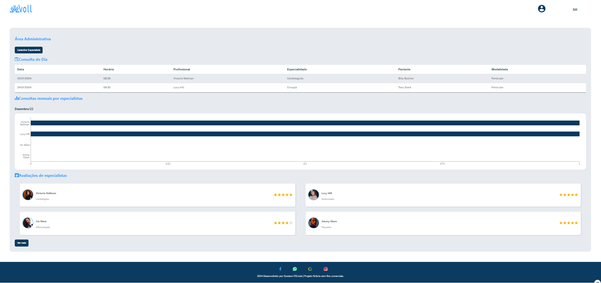

<h1 align="center">Voll - Página da Empresa</h1>

Uma página para a empresa fictícia de medicina Voll, construída com React, TypeScript, Styled-Components, MUI, Recharts e Json Server.  

  <a href="https://voll-project-ruby.vercel.app">Visualize o projeto aqui!</a>

 

  

## 🚀 Tecnologias

Esse projeto foi desenvolvido com as seguintes tecnologias:

- React
- TypeScript
- Styled-Components
- MUI (Material-UI)
- Recharts
- Json Server
- Git e Github

## 💻 Projeto

A página da empresa Voll é um website que apresenta dados fictícios de uma empresa de medicina. A biblioteca MUI foi utilizada para criar uma tabela que exibe informações relevantes, enquanto a Recharts foi empregada para construir um gráfico ilustrativo. O projeto foi construído com React e TypeScript para aproveitar os benefícios do desenvolvimento tipado, e Styled-Components para estilização de componentes de maneira eficiente. 

Além disso, o Json Server foi utilizado para simular uma API REST, permitindo a criação e manipulação de dados de maneira rápida e simples durante o desenvolvimento.

### Funcionalidades

- Tabela de dados utilizando MUI
- Gráfico ilustrativo utilizando Recharts
- Simulação de API com Json Server
- Estilização de componentes com Styled-Components
